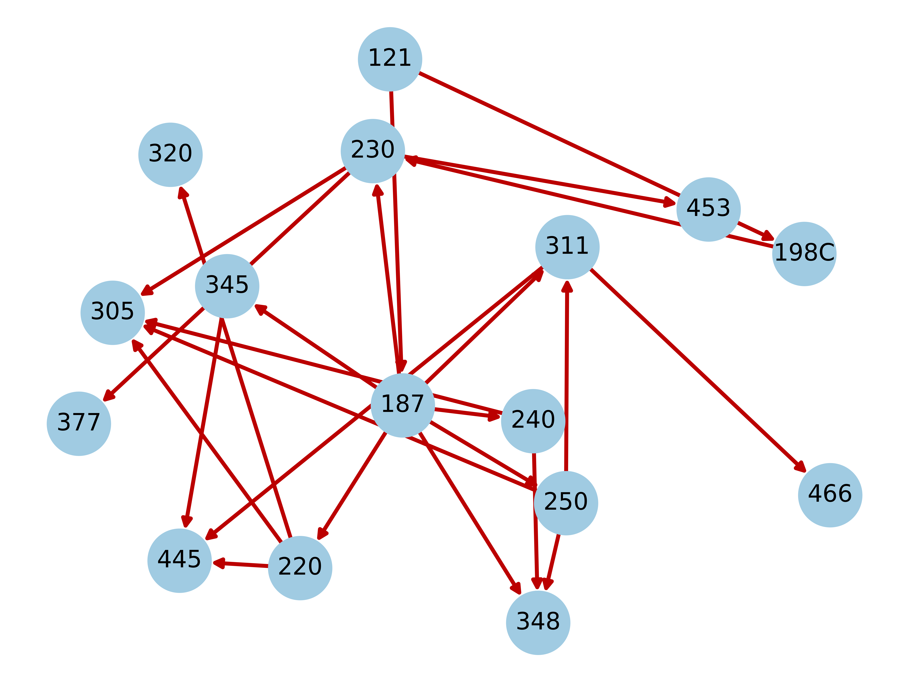

# CoursePlanner
CICS CoursePlanner intends to be a smart tool to help empower students choose courses geared towards their interests. 

Profile Page                 |  Planner Page               
:-------------------------:|:-------------------------:
  |  

# Features

1. Planning Ahead: Make sure you get the prerequites satisfied for future courses
2. Focus your Degree: Indicate your interests to take the courses that matter most
3. Informed Decisions: Easy access to RateMyProfessor reviews for every course

# Concept

The project highly emphasizes algorithms with graph theory. We used the following process:
1. Integrate with school systems to get course information
2. Build a network graph that represents pre-requsite to course mapping
3. Interface with RateMyProfessor API to calculate course ratings
4. And surely a lot of algos to develop an optimal course path!

# Demo

https://user-images.githubusercontent.com/33387859/201512354-740ddeca-8d79-4d7b-9683-a99b4442efb1.mov

# Tech Stack

# Special Thanks
- Spire API: https://spire-api.melanson.dev/
- CICS Consultant: https://cics-consultant.herokuapp.com/html/fields.html (for course categories)

